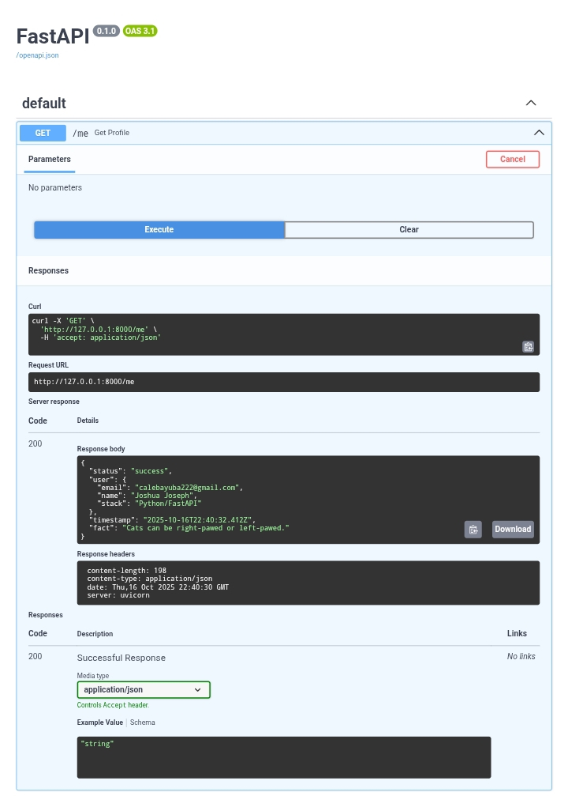

# User profile API with a random cat fact

A simple FastAPI application that fetches a user profile with a random cat facts from the [catfact.ninja](https://catfact.ninja) API and handles errors gracefully — including timeouts, service unavailability, and fallbacks.

---

## 🚀 Features

- Fetches user profile
- Fetches random cat facts from an external API  
- Gracefully handles timeouts and API downtime  
- Returns responses in ISO 8601 timestamp format  
- Built with **FastAPI** and **HTTPX**

---

## 🧰 Tech Stack

- **Python 3.12+**  
- **FastAPI** — for the web framework  
- **HTTPX** — for async HTTP requests  
- **Uvicorn** — for running the ASGI server  

---

## 📦 Setup Instructions

Follow these steps to set up and run the project locally.

### 1. Clone the Repository
```bash
git clone https://github.com/izzyjosh/hng-zero.git
cd cat-fact-api
```
### 2. Create a virtual environment
```
python -m venv .venv
source .venv/bin/activate
```
### 3. Install dependencies
```
pip install -r requirements.txt
```
### 4. Finally, run the project using
```
python app.py
```

## Test

